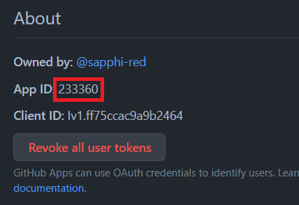
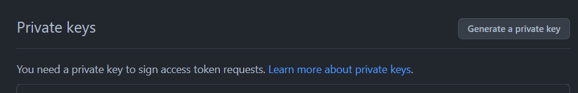

# Setting up "PR comment trigger" feature

## (1) Create a GitHub App

1. [Create a GitHub App](https://docs.github.com/en/apps/creating-github-apps/registering-a-github-app/registering-a-github-app). Webhook is not needed. The following permissions are required:
   - Metadata: Read only
   - Actions: Read and Write
   - Issues: Read and Write
   - Pull requests: Read and Write
1. Install that App to the organization/user. Give that App access to sveltejs/svelte and sveltejs/svelte-ecosystem-ci.
1. Check the App ID. It's written on `https://github.com/settings/apps/<github-app-name-slug>`. This is used later.
   
1. Generate a private key. It can be generated on the same page with the App ID. The key will be downloaded when you generate it.
   

## (2) Adding secrets to sveltejs/svelte and sveltejs/svelte-ecosystem-ci

- sveltejs/svelte
  - `ECOSYSTEM_CI_GITHUB_APP_ID`: ID of the created GitHub App
  - `ECOSYSTEM_CI_GITHUB_APP_PRIVATE_KEY`: the content of the private key of the created GitHub App
- sveltejs/svelte-ecosystem-ci
  - `ECOSYSTEM_CI_GITHUB_APP_ID`: ID of the created GitHub App
  - `ECOSYSTEM_CI_GITHUB_APP_PRIVATE_KEY`: the content of the private key of the created GitHub App

## (3) Adding workflows to sveltejs/svelte

Add [this workflow](https://github.com/sveltejs/svelte/blob/main/.github/workflows/ecosystem-ci-trigger.yml).
